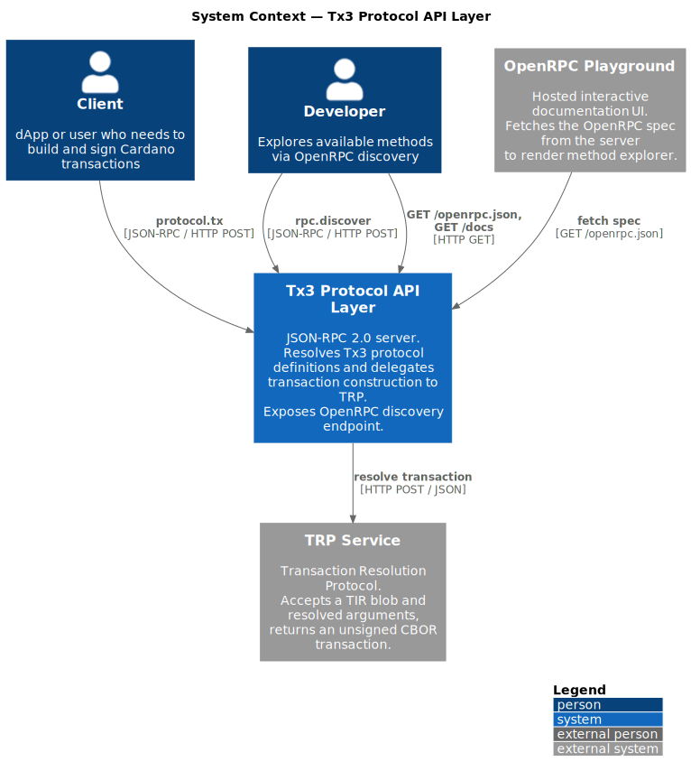
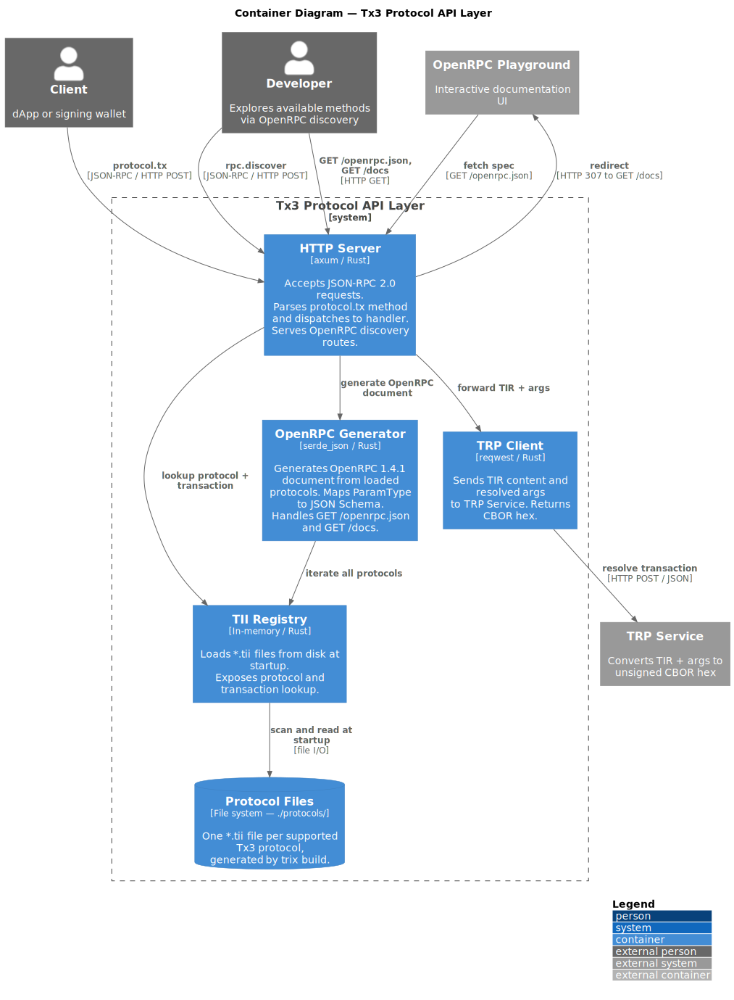

# API Scaffolding Spec — Tx3 Protocol API Layer

## Overview

This document specifies the initial scaffold for a JSON-RPC 2.0 server that dynamically exposes
Tx3 protocols via dynamic methods in the format `protocol.tx`. The server reads protocol definitions
from `.tii` files at startup, validates incoming requests against each protocol's schema, and
delegates transaction construction to an external TRP (Transaction Resolution Protocol) HTTP service.

The server does not contain any protocol-specific logic. Adding a new protocol is as simple as
dropping a `.tii` file into the `protocols/` directory and restarting the server.

---

## Transport

| Property       | Value                    |
|----------------|--------------------------|
| Protocol       | HTTP/1.1                 |
| Method         | POST                     |
| Path           | `/`                      |
| Content-Type   | `application/json`       |
| Encoding       | UTF-8                    |

All requests and responses follow **JSON-RPC 2.0** (`"jsonrpc": "2.0"`).

---

## Method

### `<protocol>.<tx>`

Dynamic methods in the format `protocol.tx` (e.g. `ticketing-2026.buy_ticket`). The server
parses the method name to resolve the protocol from the TII registry and locate the requested
transaction, validates the provided arguments, forwards the TIR to TRP, and returns the
resulting unsigned transaction as CBOR hex.

The network is configured at server startup via the `NETWORK` environment variable (defaults
to `"mainnet"`), not per-request.

#### Request

```json
{
  "jsonrpc": "2.0",
  "id": 1,
  "method": "<protocol>.<tx>",
  "params": { ... }
}
```

| Field    | Type     | Required | Description                                                                                                           |
|----------|----------|----------|-----------------------------------------------------------------------------------------------------------------------|
| `method` | `string` | yes      | `protocol.tx` format — protocol identifier + transaction name separated by a dot (e.g. `"ticketing-2026.buy_ticket"`). |
| `params` | `object` | yes      | Flat key-value map of caller-supplied arguments. Profile defaults are applied first; `params` values override them.    |

> **`params` is a flat object.** It combines parties, environment variables, and transaction
> parameters in a single map. The server-configured network determines which TII profile is
> activated; known values are pre-filled and the caller only needs to supply the remaining ones.
> All fields are validated together against the combined schema before being forwarded to TRP.

#### Response (success)

```json
{
  "jsonrpc": "2.0",
  "id": 1,
  "result": {
    "tx": "<hex-encoded-unsigned-tx-cbor>",
    "hash": "<tx-hash>" // optional, if TRP provides it
  }
}
```

| Field       | Type     | Description                                            |
|-------------|----------|--------------------------------------------------------|
| `result.tx` | `string` | Hex-encoded CBOR of the unsigned, unsubmitted transaction. |
| `result.hash` | `string` | Optional transaction hash, if provided by TRP. |

#### Response (error)

```json
{
  "jsonrpc": "2.0",
  "id": 1,
  "error": {
    "code":    <integer>,
    "message": "<human-readable description>",
    "data":    { ... }
  }
}
```

---

## Example Exchange

Using the `ticketing-2026` protocol, `buy_ticket` transaction. Server started with
`NETWORK=mainnet` (or default).

The `mainnet` profile pre-fills `issuer`, `treasury`, `issuer_beacon_policy`,
`issuer_beacon_name`, `ticket_policy`, `issuer_script_ref`, and `ticket_price`
from the TII. The caller only needs to supply `buyer`.

**Request:**
```json
{
  "jsonrpc": "2.0",
  "id": 42,
  "method": "ticketing-2026.buy_ticket",
  "params": {
    "buyer": "addr1qx2fxv2umyhttkxyxp8x0dlpdt3k6cwng5pxj3jhsydzer3jcu5d8ps7zex2k2xt3uqxgjqnnj83ws8lhrn648jjxtwq2ytjqp"
  }
}
```

**Resolved args after profile merge (what gets validated and sent to TRP):**
```json
{
  "buyer":                "addr1qx2fxv...",
  "issuer":               "addr1wywecz65rtwrqrqemhrtn7mrczl7x2c4pqc9hfjmsa3dc7cr5pvqw",
  "treasury":             "addr1qx0decp93g2kwym5cz0p68thamd2t9pehlxqe02qae5r6nycv42q...",
  "issuer_beacon_policy": "e1ddde8138579e255482791d9fba0778cb1f5c7b435be7b3e42069de",
  "issuer_beacon_name":   "425549444c45524645535432303236",
  "ticket_policy":        "1d9c0b541adc300c19ddc6b9fb63c0bfe32b1508305ba65b8762dc7b",
  "issuer_script_ref":    "31596ecbdcf102c8e5c17e75c65cf9780996285879d18903f035964f3a7499a8#0",
  "ticket_price":         500000000
}
```

**Response:**
```json
{
  "jsonrpc": "2.0",
  "id": 42,
  "result": {
    "tx": "84a500818258204dce7e..."
  }
}
```

---

## Error Codes

| Code    | Name               | When                                                                              |
|---------|--------------------|-----------------------------------------------------------------------------------|
| -32700  | `ParseError`       | JSON payload could not be parsed.                                                 |
| -32600  | `InvalidRequest`   | JSON-RPC envelope is malformed.                                                   |
| -32601  | `MethodNotFound`   | Method format is invalid or could not be parsed as `protocol.tx`.                 |
| -32602  | `InvalidParams`    | `params` is not a valid JSON object.                                              |
| -32603  | `InternalError`    | Unexpected server error.                                                          |
| -32000  | `ProtocolNotFound` | Protocol name from the method does not match any loaded TII.                      |
| -32001  | `TxNotFound`       | Transaction name from the method does not match any transaction in the protocol.  |
| -32002  | `ArgsMismatch`     | Resolved args fail the combined schema check (after profile merge).               |
| -32003  | `BuildError`       | TRP returned an error (e.g. insufficient UTxOs, bad amounts).                     |
| -32004  | `NetworkNotFound`  | Server-configured network does not match any profile in the TII.                  |

---

## TII File Structure

Each supported protocol is described by a `.tii` file (JSON) generated by the
[trix build](https://github.com/tx3-lang/trix) command. Files live in:

```
protocols/
├── basic_example.tii
└── ...
```

The server scans this directory at startup and registers every `.tii` it finds. The registry
key is `protocol.name` from inside the file.

### Relevant TII fields

```
TII file
├── protocol.name          → registry key (string)
├── environment            → JSON Schema for protocol-level env variables
│                            (e.g. issuer_beacon_policy, ticket_price, ...)
├── parties                → map of party-name → JSON Schema
│                            (e.g. buyer: {}, issuer: {}, treasury: {})
├── profiles
│   └── <network>          → named profile (mainnet, preview, preprod, ...)
│       ├── environment    → pre-filled values for env vars
│       └── parties        → pre-filled values for party addresses
└── transactions
    └── <tx-name>
        ├── params         → JSON Schema for tx-specific parameters
        └── tir
            ├── content    → hex-encoded CBOR blob (the TIR)
            ├── encoding   → "hex"
            └── version    → e.g. "v1beta0"
```

## Profile Resolution

The server applies the TII profile corresponding to the configured `NETWORK` environment
variable before validating and forwarding args.

### Merge order (lower index = lower priority)

| Priority | Source                          | Example values                                |
|----------|---------------------------------|-----------------------------------------------|
| 1 (base) | `profiles.<network>.environment`| `ticket_price: 500000000`, beacon policies... |
| 1 (base) | `profiles.<network>.parties`    | `issuer: "addr1..."`, `treasury: "addr1..."` |
| 2 (top)  | Caller-supplied `params`        | `buyer: "addr1..."` (overrides anything)      |

Caller-provided values always win. This allows overriding a profile default when needed
(e.g. using a custom treasury address in a test scenario).

### Validation

After merging, the resolved flat map is validated against a combined JSON Schema built from:
1. The root `environment` schema (protocol-level env var types).
2. Each entry in root `parties` (party address schemas).
3. The `transactions.<name>.params` schema (tx-specific parameters).

All three sources are merged into a single `object` schema. Validation runs on the
**resolved** args (post-merge), not the raw caller input, so profile-supplied values
contribute to satisfying required fields.

### Default network

The network is configured at server startup via the `NETWORK` environment variable.
When `NETWORK` is not set, the server defaults to `"mainnet"`.

---

## Architecture

### Level 1 — System Context 



> Source [001-assets/c4-context.puml](001-assets/c4-context.puml)

### Level 2 — Containers



> Source [001-assets/c4-container.puml](001-assets/c4-container.puml)

---

## Module Structure

```
src/
├── main.rs          # Startup: load TII registry, init TRP client, start server
├── server.rs        # axum router, port binding
├── config.rs        # Configuration from environment variables
├── rpc/
│   ├── mod.rs
│   ├── dispatcher.rs  # Parse JSON-RPC envelope, route to handler
│   ├── handler.rs     # invoke_tx: registry lookup → invoke → resolve → TRP
│   └── error.rs       # RpcError enum, JSON serialisation, error codes
└── registry/
    └── mod.rs         # TiiRegistry: scan *.tii files, key by protocol.name
```

TII parsing, profile resolution, and TRP communication are all handled by `tx3-sdk`.
No additional modules are needed for those concerns.

---

## Key Types

### TII — `tx3_sdk::tii`

The canonical `.tii` schema is defined in the tx3 toolchain at
[`bin/tx3c/src/tii/types.rs`](https://github.com/tx3-lang/tx3/blob/506dd01ad3379eb173f50ba410016eeed7ae3ac7/bin/tx3c/src/tii/types.rs).
At runtime, files are loaded via `tx3_sdk::tii::Protocol`:

| Method | Description |
|--------|-------------|
| `Protocol::from_file(path)` | Deserialise a `.tii` file from disk |
| `Protocol::from_json(value)` | Deserialise from a `serde_json::Value` (used to extract `protocol.name` first) |
| `protocol.invoke(tx, profile)` | Look up a transaction and apply the named profile; returns `Invocation` |

`invoke(tx, Some("mainnet"))` handles both the transaction lookup and profile merge in one call.
Returns an error if the transaction name or profile name does not exist.

### Invocation — `tx3_sdk::tii::Invocation`

| Method | Description |
|--------|-------------|
| `invocation.set_args(args)` | Supply caller-provided args (flat `serde_json::Value` map) |
| `invocation.into_resolve_request()` | Produce a `trp::ResolveParams` ready to send to TRP |

```rust
let invocation = protocol
    .invoke(tx_name, Some(network))?   // tx lookup + profile merge
    .with_args(caller_args);           // attach resolved args

let resolve_params = invocation.into_resolve_request()?;
let envelope = trp_client.resolve(resolve_params).await?;
```

### TRP client — `tx3_sdk::trp`

| Type / Method | Description |
|---------------|-------------|
| `ClientOptions { endpoint, headers }` | TRP endpoint URL + optional HTTP headers |
| `Client::new(options)` | Initialise the async TRP HTTP client |
| `client.resolve(ResolveParams)` | POST to TRP; returns `TxEnvelope` containing the CBOR hex |

### Registry — our code only

```rust
// registry/mod.rs
pub struct TiiRegistry {
    protocols: HashMap<String, tx3_sdk::tii::Protocol>,
}

impl TiiRegistry {
    /// Scan a directory for *.tii files. Key = protocol.name from inside each file.
    pub fn load_dir(path: &Path) -> Result<Self, RegistryError>;
    pub fn get(&self, name: &str) -> Option<&tx3_sdk::tii::Protocol>;
}
```

Protocol names are read by parsing the raw JSON with `serde_json` to extract
`protocol.name`, then the same `Value` is passed to `Protocol::from_json()`.

---

## Configuration

All configuration is read from environment variables at startup.

| Variable        | Default                   | Description                                                        |
|-----------------|---------------------------|--------------------------------------------------------------------|
| `TRP_URL`       | `http://localhost:3000`   | Endpoint passed to `tx3_sdk::trp::ClientOptions` at startup.      |
| `TRP_HEADERS`   | *(not set)*               | HTTP headers for TRP, comma-separated `key=value` pairs (e.g. `dmtr-api-key=mykey`). Used when `TRP_URL` is set. |
| `PROTOCOLS_DIR` | `./protocols`             | Directory scanned for `*.tii` files to populate the registry.     |
| `PORT`          | `8080`                    | Port the API server listens on.                                    |
| `NETWORK`       | `mainnet`                 | Network / profile name to activate for all requests.               |

---

## Dependencies (initial)

Declare every crate that **this codebase imports directly**, regardless of whether it is also
a transitive dependency of `tx3-sdk`. Relying on transitive availability is fragile: an
upstream version bump or refactor can silently remove a type your code depends on.

| Crate        | Used directly in our code                                                       |
|--------------|---------------------------------------------------------------------------------|
| `axum`       | HTTP server, router, extractors                                                 |
| `tokio`      | `#[tokio::main]`, async runtime primitives                                      |
| `serde`      | `#[derive(Deserialize)]` on the JSON-RPC envelope struct                        |
| `serde_json` | `serde_json::Value` for args; `serde_json::from_str` to extract `protocol.name` |
| `tx3-sdk`    | `tii::Protocol`, `trp::Client`, `trp::ClientOptions`, `trp::ResolveParams`      |
| `thiserror`  | `#[derive(Error)]` on internal error types                                      |

`reqwest` and other tx3-sdk internals are not imported directly by this codebase.

---

## Request Handling Flow

```
1.  Receive POST /
2.  Deserialize JSON-RPC envelope
3.  Parse method as "protocol.tx"                       → MethodNotFound if invalid format
4.  Extract params as flat args object                  → InvalidParams if not an object
5.  registry.get(protocol)                              → ProtocolNotFound if missing
6.  protocol.invoke(tx, Some(network))                  → TxNotFound | NetworkNotFound if missing
         (tx3-sdk: tx lookup + profile merge; network from NETWORK env var)
7.  invocation.with_args(params)
8.  invocation.into_resolve_request()                   → ResolveParams
9.  trp_client.resolve(resolve_params)                  → BuildError on TRP failure
10. Return { "result": { "tx": envelope.cbor_hex } }
```

Steps 6–8 are handled by `tx3-sdk`. Step 9 is `tx3_sdk::trp::Client`.

---

## Out of Scope for this Milestone

- Authentication / authorization
- Hot-reload of TII files (server restart required to pick up new protocols)
- Transaction submission (only construction / CBOR generation)
- Multiple transport protocols (only HTTP POST to `/`)
- Schema introspection endpoint
